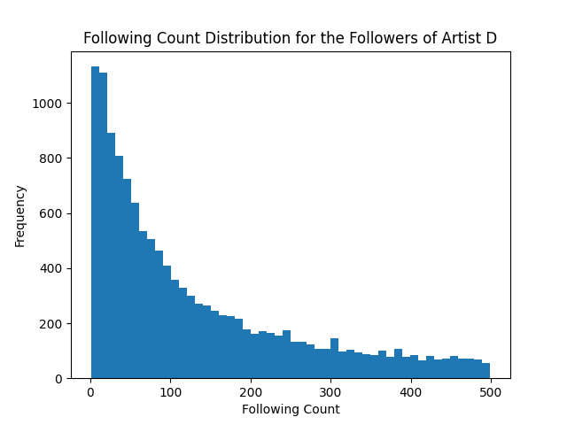

# soundcloud-analysis

The goal of this project is too find characteristics in SoundCloud artists' profiles that would suggest the use of illegitimate traffic i.e., buying followers.

## Identifying Anomalies

My first choice of action was to identify artists with anomalies in their profile data, specifically the follower count. I first computed the linear regression model for each artist's follower count, the trajectory, and the root mean square error for the model.

By plotting the model's trajectory against the model's error for each artist, we can distinguish artists with fast unexpected follower growth from others.

Here we can clearly see the vast majority of artists cluster towards the bottom left of the scatter plot, and it is increasingly rare to see artists the closer we move to the top right of the plot.

***TODO:*** *Incorporate track count into model?*  

## Taking a Closer Look

I used the scatter plot above to compile a small list of artists with the most unexpected/fast follower gain. I then visited each profile and compared their track stats (views, comments, likes) with that of mainstream artists. While there were clear indicators of coordinated traffic, such as high view counts with very low like counts and irregular comments, my most interesting discovery was in the followers themselves.

After visiting many of the user pages of the followers of suspicious artists, I noticed how many followers had similar following counts to each other.

## Following Count Distributions of Followers (FF)

I first collected the following counts of the followers of four mainstream artists to compare with the suspicious accounts (outliers as seen in Figure A).

The following are histograms that show the distributions for the following count for the followers of each of these artists.

Next, I collected the following counts of the followers of a few of the accounts that were outliers from the rest of my dataset.

The following are histograms that show the distributions for the following count for the followers of each of these artists.

There is clearly a difference between the FF distribution of mainstream artists and suspicious ones. There is clustering at oddly specific points in the histograms for suspicious artists, rather than the normal right skewed unimodal distribution of mainstream artists.

While it is too early to give a definitive explanation for this, it could possibly be due to the fact that fake accounts that are made to follow accounts are more likely to follow more accounts than the average user.

***TODO:*** *Numerically model the distribution above*

## Marking Artists with Irregular FF Distributions

I am still in the process of numerically modeling the FF distributions to more accurately classify the distributions of followers of artists, so the artists marked as "Verified Irregular Follower Distribution" have not been quantitatively proved as such.

***TODO:*** *Verify the distributions of more artists*   
